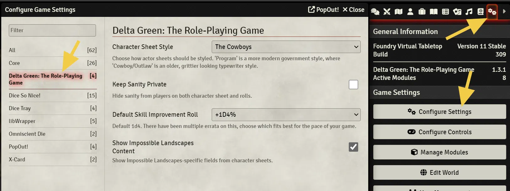
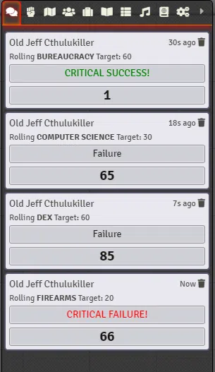
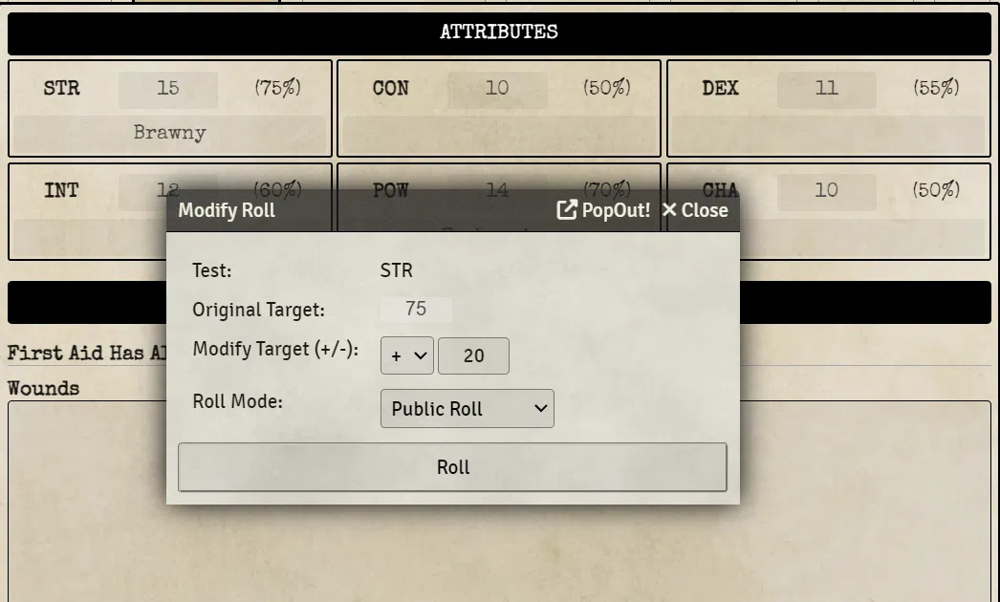
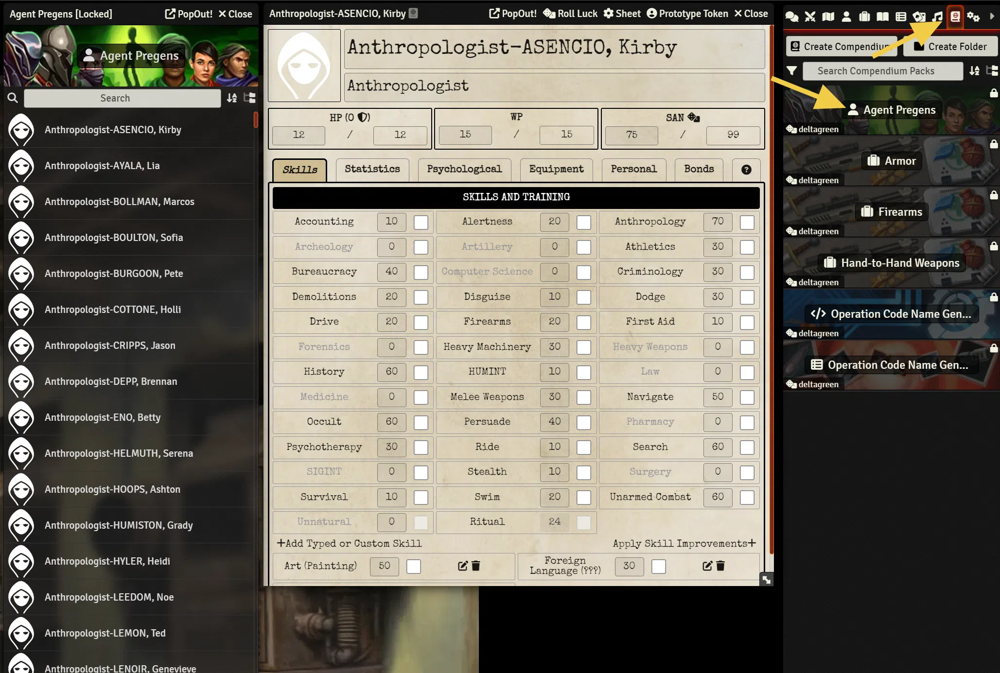

# Official Implementation of _Delta Green: The Role-Playing Game_ System for Foundry Virtual Tabletop

Officially supported rules implementation (system) for [Foundry Virtual Tabletop](https://foundryvtt.com/) system for Delta Green: The Role-Playing Game, based on the _Agent's Handbook_ rule set from Arc Dream Publishing (_**not** the Call of Cthulu rules_).

Published by Arc Dream Publishing by arrangement with the Delta Green Partnership. The intellectual property known as Delta Green is a trademark and copyright owned by the Delta Green Parternship, who has licensed its use here.

The contents of this system are licensed under the terms of the included [license](LICENSE.txt) file, excepting those elements that are components of the Delta Green intellectual property.

Please consider supporting the publisher by buying a copy of the official rule book, which can be done here:

https://shop.arcdream.com/collections/role-playing-games/products/delta-green-agents-handbook

https://www.drivethrurpg.com/product/181674/Delta-Green-Agents-Handbook

More details on Delta Green can be found here:

http://www.delta-green.com/

# System Overview

Whatever system documentation currently exists can be found [here.](https://github.com/TheLastScrub/delta-green-foundry-vtt-system/blob/master/documentation/home.md)

_NOTE_ - There is a system setting that controls the styling of the sheets. The current default is "Program" which gives a more modern look. To look more like the way the system looked prior to v1.3.0, choose the 'Cowboys' option.

See samples of all tabs in the main agent character sheet [here](./documentation/agent_sheet_sample.md).

The system automates most of the calculations on the sheet such as maximum HP/WP/SAN. Recalculating break points can be done by clicking a button. Clicking on labels for skills, sanity, x5 skill tests or weapon damage/lethality will automatically roll those tests or damage.

Likewise, right-clicking or shift-clicking on a field will bring up a dialogue to modify that roll (default: +20).

There is a compendium with numerous sample agents (parsed from the work of _jets_or_chasm_ and _morlock_) of all the professions to get players started quickly if they do not wish to build an Agent themselves, or quickly need a replacement:

There are also some compendiums currently available with some of the more commonly used items that can be dragged directly onto a character sheet (and then modified as necessary).

# System Status

The system is now largely stable and publicably available in Foundry as an official system! There will still be tweaks here and there, but no major changes are currently planned.

If there is specific functionality you would like incorporated in the system, please open an issue on the [Issues](https://github.com/TheLastScrub/delta-green-foundry-vtt-system/issues) tab in Github.

# Installation Guide

The system is now included in the list of official Foundry VTT game systems, and as such can be installed directly from within Foundry.

If there is a need to manually install the system, go to _Game Systems_ and click _Install System_. Then in the _Manifest URL_ input field, paste the following link and then click _Install_:

https://github.com/TheLastScrub/delta-green-foundry-vtt-system/raw/master/system.json

# Foundry VTT License

This code uses the Foundry VTT and its API under the terms of the Limited License Agreement for Module Development.
Foundry VTT is a Copyright of Foundry Gaming, LLC.

# Delta Green Community License

Published by arrangement with the Delta Green Partnership. The intellectual property known as Delta Green is a trademark and copyright owned by the Delta Green Partnership, who has licensed its use here. The contents of this system are licensed per the terms of the included LICENSE.TXT file, excepting those elements that are components of the Delta Green intellectual property.

# Other Licenses, Attributions and Shoutouts

## System Template

This system is built upon on Matt Smith's (AKA Asacolips) excellent Boilerplate System and corresponding tutorial.
https://gitlab.com/asacolips-projects/foundry-mods/foundryvtt-system-tutorial

## Delta Green Agent Pregen List

Comes from a character generator created by jimstorch, who graciously posted the results on Reddit for all to use. See the GitHub page for more information: https://github.com/jimstorch/DGGen

## Operation Code Name Generator

The roll tables added to generate operation code names comes from Reddit user /u/Travern.

## Localization

Portugese (BR) Translation submitted by IgorAK25
Spanish Translation submitted by CthulhuRol
Catalonian Translation submitted by trombonecot

## Fonts (Some in use, others that I would like to use at some point)

### MARTEL FONT

By Dan Reynolds (Principal Designer)
https://fonts.google.com/specimen/Martel?query=martel#license

License: Open Font License.
https://scripts.sil.org/cms/scripts/page.php?site_id=nrsi&id=OFL

### SPECIAL ELITE FONT

By Astigmatic (Principal Design)
https://fonts.google.com/specimen/Special+Elite?sidebar.open&selection.family=Special+Elite#standard-styles

License: Apache License, Version 2.0
http://www.apache.org/licenses/LICENSE-2.0

### DIDACT GOTHIC FONT

By Daniel Johnson and Cyreal
https://fonts.google.com/specimen/Didact+Gothic?query=did#about

License: Open Font License.
https://scripts.sil.org/cms/scripts/page.php?site_id=nrsi&id=OFL

### TYPEWRITER CONDENSED FONT

By Volker Busse - F25 Digital Typeface Design
License: None given
https://www.dafont.com/typewriter-condensed.font

### ANOTHER TYPEWRITER FONT

By Johan Holmdahl
License: None given
https://www.dafont.com/another-typewriter.font

### PUBLIC SANS FONT

Designed by USWDS, Dan Williams, Pablo Impallari, Rodrigo Fuenzalida
License: Open Font License.
https://github.com/uswds/public-sans

## Game Icons

ICONS - https://game-icons.net/
https://creativecommons.org/licenses/by/3.0/

- Sawed-off shotgun icon by Delapouite under CC BY 3.0
- Crosshair icon by Delapouite under CC BY 3.0
- Two handed sword icon by Delapouite under CC BY 3.0
- Katana icon by Delapouite under CC BY 3.0
- Baseball bat icon by Delapouite under CC BY 3.0
- Hatchet icon by Delapouite under CC BY 3.0
- Wood axe icon by Delapouite under CC BY 3.0
- Brass knuckles icon by Delapouite under CC BY 3.0
- Flashlight icon by Delapouite under CC BY 3.0
- Wire icon by Delapouite under CC BY 3.0
- Gun stock icon by Delapouite under CC BY 3.0
- AK47 icon by Skoll under CC BY 3.0
- Switchblade icon by Skoll under CC BY 3.0
- Desert Eagle iconby Skoll under CC BY 3.0
- Colt M1911 icon by Skoll under CC BY 3.0
- Revolver icon by Skoll under CC BY 3.0
- Lee Enfield icon by Skoll under CC BY 3.0
- FN FAL icon by Skoll under CC BY 3.0
- Walther PPK icon by Skoll under CC BY 3.0
- Kevlar vest icon by Skoll under CC BY 3.0
- Spectre M4 icon by Skoll under CC BY 3.0
- FN Fal icon by Skoll under CC BY 3.0
- Telescopic baton icon by Skoll under CC BY 3.0
- Baton icon by Skoll under CC BY 3.0
- Bayonet icon by Skoll under CC BY 3.0
- Jaws icon by Skoll under CC BY 3.0
- Helmet icon by sbed under CC BY 3.0
- Kevlar icon by sbed under CC BY 3.0
- Bowie knife icon by Lorc under CC BY 3.0
- Space suit icon by Lorc under CC BY 3.0
- Grenade icon by Lorc under CC BY 3.0
- Stiletto icon by Lorc under CC BY 3.0
- Punch icon by Lorc under CC BY 3.0.
- Arrowhead icon by Lorc under CC BY 3.0
- Claw Slashes icon by Lorc under CC BY 3.0
- Magic Hand icon by Lorc under CC BY 3.0
- Magic Shield icon by Lorc under CC BY 3.0
- Sly icon by Lorc under CC BY 3.0
- Swap Bag icon by Lorc under CC BY 3.0
- Person icon by Delapouite under CC BY 3.0
- Cowled icon by Lorc under CC BY 3.0

- Various more from Delapouite, John Colburn, Lorc, Pierre, Leducq, Sbed, and Skull.
