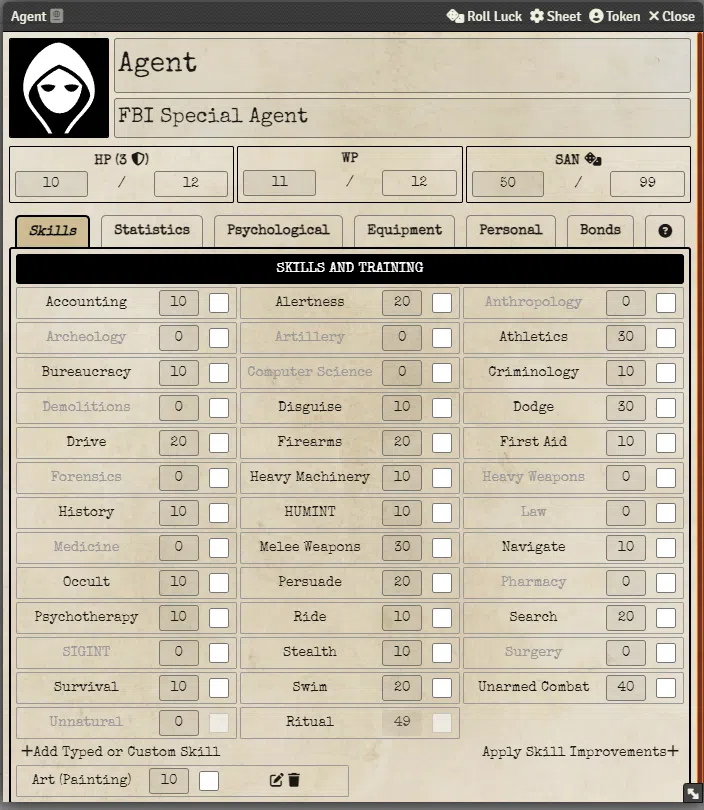
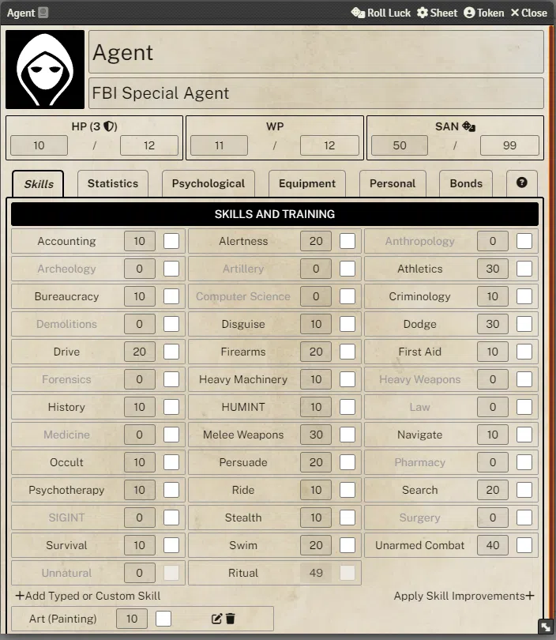
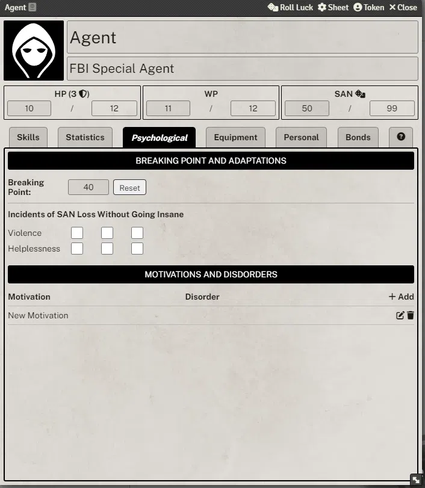
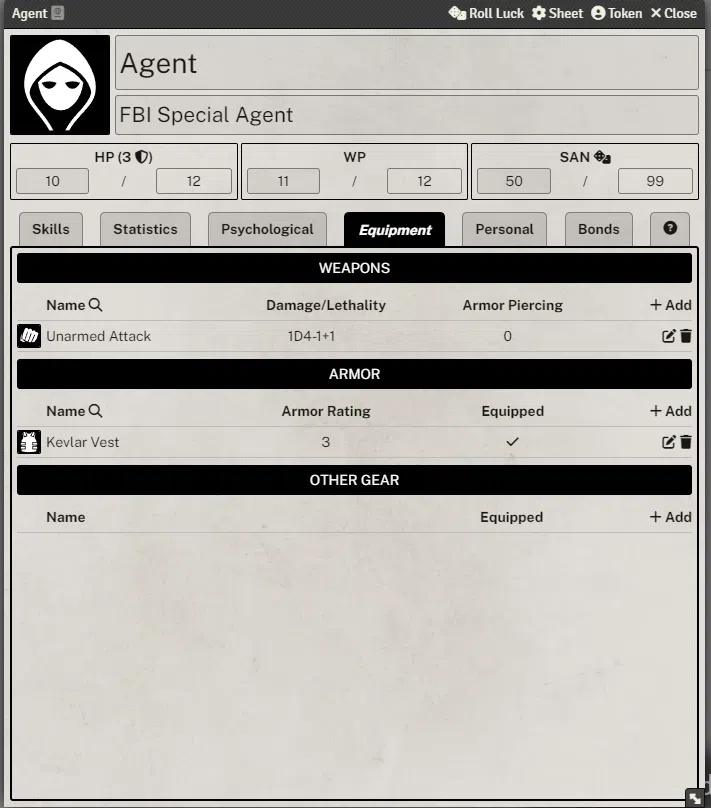
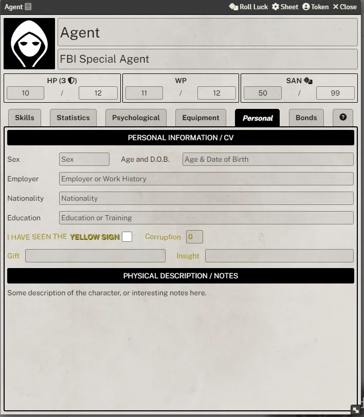
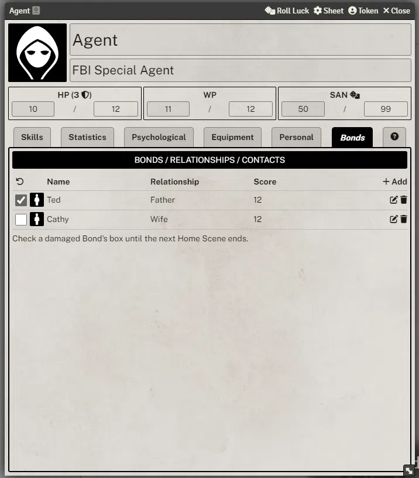

# Sample Agent Sheet Screenshots

**Note** - You can control the overall 'style' of the sheets by adjusting the system setting shown below:

The "Cowboys" setting gives the oldest feel, with a typewriter font and an weathered paper. "Outlaw" is the middle option, with weathered paper, but a more modern font. "Program" is the default, and gives a cleaner and brighter paper and a modern font.

## Skills

### Cowboy Setting

### Outlaw Setting

### Program Setting

## Physical

## Mental

## Gear

## CV

## Contacts

