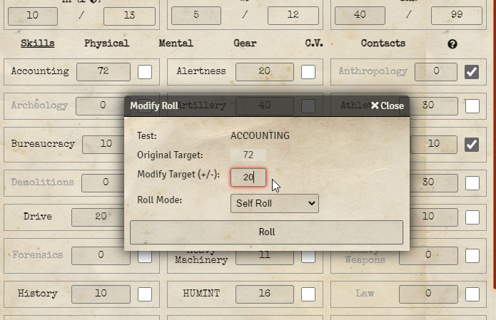
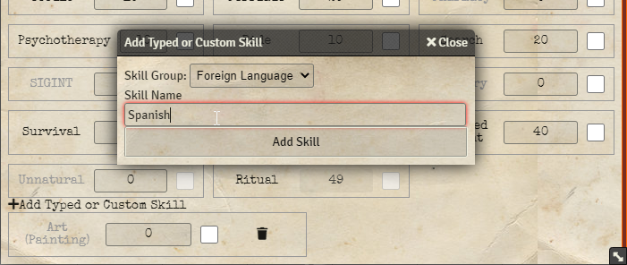
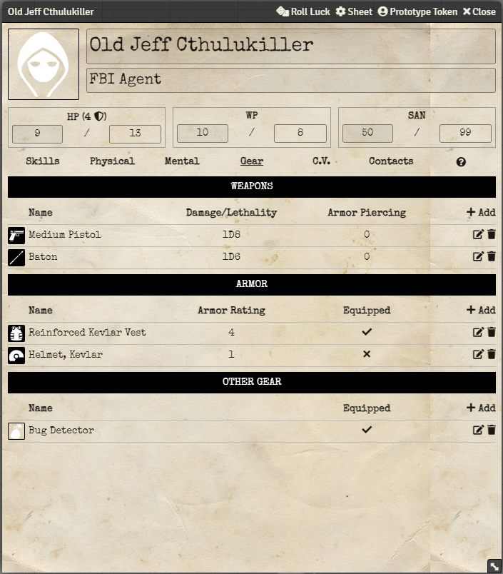

# System Documentation

## Rolling Checks

Most labels can be clicked to roll a check or test of some kind. If they can be clicked, they should glow red when the mouse is hovered over them.  

* Click on _SAN_ (label above current/max sanity) to roll a Sanity check.
* Click on any of the skill labels (such as _Accounting_) to roll a skill test.
* Click on the name of a physical statistic (such as _STR_, on the _Physical_ tab) to roll a test.
* Click on a weapon name (on the _Gear_ tab) to roll the skill test associated with it (e.g. _Firearms_).
* Click on the Damage/Lethality associated with a weapon to roll it.

## Modifying Rolls On the Fly

Shift-clicking or right-clicking will bring up a dialogue to allow modifying the roll.

## Where are the Specialized Skills Like 'Science' and 'Pilot'?

Only one 'Typed' skill is shown for an Agent by default, that being Art (Painting), and it is *below* all the other skills.  It can be removed by clicking the trash icon inside the box for the skill.  Likewise, new typed skills can be added by clicking the _+_ button just above the section.

This allows adding any number of skills as needed, without having dead space for unused skills.

## Why Does the 'Lethality' Roll Show Damage Even on a Success?

For Lethality, the D100 test against the target lethality threshold is evaluated like a normal skill test. But regardless of the outcome, the damage associated with a non-lethal roll (2D10) is also displayed in paretheses as lethality does not affect some creatures.

Note - the Lethality roll does not currently take into account the changes that rolling a critical on the associated attack roll involves.  For example, on a critical _Firearms_ check with a weapon with a lethality of 10%, the threshold doubles to 20%, and if that check fails the resulting damage doubles as well.

## Where is The Breaking Point Shown?

It is under the _Mental_ tab, as are the boxes to tick for _Incidents of Sanity Loss Without Going Insane_ and an Agents _Motivations_ and _Disorders_.

## "Inhuman Rules" - Why are Results for x5 Tests Different for Creatures with a x5 that is Greater than 100%?

Per the rules in the Handler's Guide, if a creature has a physical attribute that is 20 or above (giving a x5 of 100% or higher), it is considered "inhuman" and all rolls that are not a 100 automatically succeed.  Furthermore, any roll that is **below the attribute score** is a critical (on top of the normal critical rules).  For example, if a monster had a strength of 25, giving a x5 of 125, that monster could score a critical not only by rolling a 33, but also by rolling anything 25 or under.

## What is the Ritual Skill

Per the rules in the Handler's Guide, the ritual skill is used (primarily) to activate rituals. It is calculated as 100 - SAN.  E.g., the lower one's sanity, the easier ritual activation becomes.  Like Unnatural, it cannot be improved through failure like other skills.

## What is the Shield Icon by Health?

This represents the total protection value of all equipped armor (click on the x or checkmark to toggle if armor is equipped or not).  This is how much damage should be subtracted from incoming attacks, assuming the incoming damage has no armor penetration.

Note there are a few limitations of this calculation.  For instance the system is unaware of certain pieces that should not stack, such as wearing multiple helmets.  Or wearing a kevlar helmet with armor that includes a helmet already (such as a bomb suit).

In the example below, the vest is equipped but the helmet is not.  As such total armor is only 4 rather than 5. Note that currently only 'Armor' type items can increase the calculated protection value.

